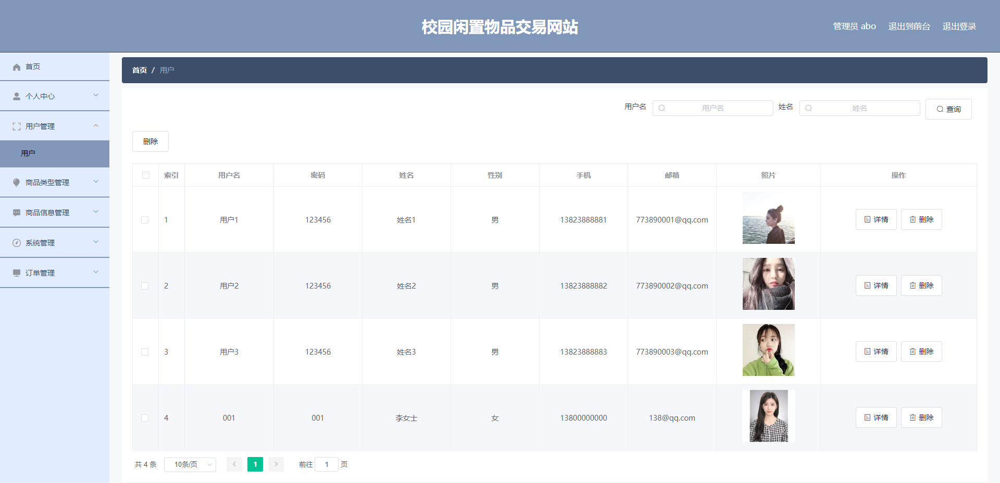

# 1 项目介绍
基于SpringBoot的闲置物品交易平台：前端Vue+ElementUI，后端 SpringBoot、SSM框架，系统用户分为两类，管理员、用户，具体功能如下：
## 管理员：
- 个人中心：查看和修改个人信息、修改密码
- 用户管理
- 商品类型管理
- 商品信息管理
- 系统管理
- 订单管理
- 轮播图管理
## 用户：
- 首页
- 个人中心：查看和修改个人信息、查看我的订单、管理收货地址、查看我的收藏
- 查看商品列表：查看商品详情、商品购买/收藏
- 购物车
- 查看商品资讯
# 2 系统运行截图
## 2.1 前台首页

## 2.2 商品详情

## 2.3 个人中心

## 2.4 购物车

## 2.5 商品管理

## 2.6 用户管理

## 2.7 商品资讯管理

## 2.8 万字文档

## 2.9 PPT

# 3 数据库

# 4 获取源码和数据库(有偿)

